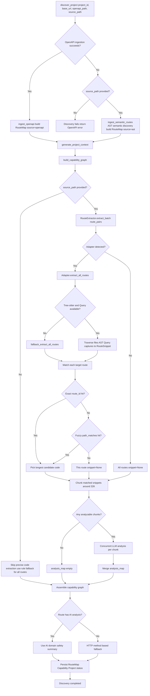

<div align="center">

# LUI-for-All

**Operate any system with natural language.**

*Language User Interface · Zero-Intrusion Integration · Enterprise-Grade Safety*
</div>

---

> Languages: [简体中文](README.md) | **English** | [日本語](README.ja-JP.md)

> Developer Protocol: [Chat Endpoint Integration](CHAT_ENDPOINT_INTEGRATION.en-US.md)

## What Problem Does It Solve?

Many backend systems, especially enterprise and internal-operation systems, are powerful but hard to use. Users must navigate complex menus, remember filter combinations, and fill repetitive forms to finish tasks that can be described in one sentence.

**LUI-for-All** adds a natural-language operation layer next to your existing system in an isolated folder, without touching your current codebase.

```text
User: "List all purchase requests pending approval from last week,
sorted by amount descending, and highlight items above 50,000."

LUI: [Understand intent -> call existing APIs -> render table + highlights]
     ✓ No modifications to your existing system code
```

## Core Highlights

1. Zero-intrusion integration and easy removal
- Runs as an isolated folder beside your project
- Uses read-only access to existing code by default
- Runtime write operations are isolated in `workspace/`

2. Hybrid discovery: OpenAPI + Tree-sitter AST
- OpenAPI-first ingestion for fast, structured route discovery
- Unified AST extraction layer (`FrameAdapter + get_tree_sitter_query`) for full handler implementation capture
- Built-in adapters for mainstream backends: Python (FastAPI/Flask/Sanic), Node.js (NestJS/Express/Fastify), Java (Spring Boot), C# (ASP.NET Core), and Go (Gin/Echo/Fiber/chi)
- Automatic AST fallback when OpenAPI is unavailable, using `source_path`
- Route parameter normalization across frameworks (for example, `:id -> {id}`) to improve matching quality

### Representative Syntax Coverage (7 Samples)

The repository now includes 7 representative backend samples with validated two-level extraction (route discovery + handler/function implementation extraction).

| Representative sample | Route style family | Current adapter coverage target (same family) | Theoretical transfer (requires adapter extension) |
|---|---|---|---|
| `fastapi_sample` | Python decorator routes (`@router.get`, `@app.post`) | FastAPI, Flask, Sanic, Starlette, Litestar, aiohttp, Bottle, Quart | Ruby Sinatra/Grape, PHP Slim |
| `node_sample` | Node call-chain routing (`app.get()`, `router.post()`) | Express, Fastify, Koa Router, Hono, Elysia, Restify | PHP Laravel/Lumen/Slim, Ruby Hanami |
| `django_sample` | Central URLConf (`path/re_path/include`) | Django, Django REST Framework | Ruby on Rails (`routes.rb`), PHP Laravel (`routes/web.php`) |
| `springboot_sample` | Controller annotations (class prefix + method mapping) | Java Spring Boot, Spring MVC | C# ASP.NET Core attribute controllers, PHP Symfony attribute routes |
| `aspnetcore_sample` | Minimal API mapping (`MapGet/MapPost/MapMethods`) | ASP.NET Core Minimal API | Java Javalin/Spark, Go net/http + mux |
| `go_gin_sample` | Grouped chain registration (`Group + METHOD(path, handler)`) | Gin, Echo, Fiber, Chi | Rust Actix/Axum, PHP Slim |
| `node_native_sample` | No-framework imperative dispatch (`if (method && path)`) | Node.js built-in http | Python wsgiref/werkzeug imperative dispatch, Ruby Rack, PHP Swoole native dispatch |

Notes:

- "Current adapter coverage target" means frameworks that share the same AST routing pattern and are covered by the implemented extractor logic.
- The repository has direct test validation for the 7 representative samples themselves: `backend/test/test_route_extractor_representative_samples.py`.
- "Theoretical transfer" means the syntax pattern is highly similar and is expected to be extractable once a dedicated adapter is added.

### AST Four-Paradigm Normalization

Discovery is now normalized into 4 AST routing paradigms. The 7 samples are framework representatives, not new paradigm types:

- `decorator_metadata`: annotation/decorator routes (FastAPI, Spring, ASP.NET controllers)
- `call_registration`: call-based registration (Express/Fastify, Gin/Echo/Fiber/Chi, ASP.NET Minimal API)
- `route_table`: centralized route table declarations (Django URLConf)
- `imperative_dispatch`: imperative control flow dispatch (Node native `if/switch`)

All four paradigms are emitted as the same `RouteSnippet` structure and go through the same chunking + LLM context flow .

### Discovery Layer Full Flow (with Branches)



3. Strict declarative UI whitelist
- Model output is JSON blocks only, not raw HTML/JS/CSS
- Supports 8 safe block types: `text_block`, `metric_card`, `data_table`, `echart_card`, `confirm_panel`, `filter_form`, `timeline_card`, `diff_card`

4. LangGraph workflow with human approval gates
- Multi-step task orchestration with checkpoints
- `interrupt()` hard pause for write-risk operations
- Resume-after-approval flow with full audit trail

5. AG-UI + SSE real-time event stream
- Node-level progress events
- Streamed reasoning and output
- Approval-triggered UI interruption without polling

6. End-to-end observability
- Unified Trace ID across API layer, graph execution, and HTTP executor
- Full-step auditable event trail

7. Multi-model gateway support
- Built-in Agent Matchbox routing
- Model switching without business code changes

8. Docker-aware connectivity for project import
- Auto-resolves sample backend addresses by runtime environment
- Uses container DNS names in Docker and `localhost` on local host
- `test-connection` and `fetch-routes` can fall back to AST discovery with `source_path`, preventing import flow from being blocked by OpenAPI reachability

9. Pluggable chat protocol for custom GUIs
- Developers can directly integrate with `chat` endpoints and replace the built-in frontend without changing backend execution logic
- Fully covers current frontend elements: AI progress, HTTP call logs, approval requests/records, reasoning stream, and 8 UI block types
- Transport boundary is explicit: streaming data over SSE, replay/audit snapshots over standard JSON APIs

10. MCP integration with OpenClaw (multi-channel execution gateway)
OpenClaw's biggest value is fully automated, unattended execution from natural language. You give it a task, and it keeps working across its own computer, accounts, and channels without needing a human to click through every step.

The combined value with LUI-for-All is more practical:

- OpenClaw handles unattended natural-language automation, while LUI-for-All pushes actions into a specific private project
- Users can send tasks inside OpenClaw and use LUI's MCP interface to reach deep into project pages, APIs, and workflows
- We keep safety levels, human confirmation, SSE progress, and HTTP call logs, so the flow stays hands-off but still traceable

Quick integration steps:

1. Start OpenClaw and let it run as the natural-language automation entry point
2. Register LUI-for-All as an MCP tool on the OpenClaw side, or bridge OpenClaw sessions to MCP clients
3. Configure the LUI-for-All MCP token and gateway URL so OpenClaw can reach your private project
4. Start with one read-only capability, then add approval-based business actions gradually

## Quick Start

### Requirements

- Python 3.11+ (Conda recommended)
- Node.js 18+ and pnpm 10
- OpenAPI is recommended (`/openapi.json` or local file)
- If OpenAPI is unavailable, provide a reachable source path (`source_path`) for AST-based discovery

### 1. Clone

```bash
git clone https://github.com/your-org/lui-for-all.git
cd lui-for-all
```

### 2. Backend setup and config

```bash
conda create -n lui python=3.11 -y
conda activate lui
pip install -r backend/requirements.txt

# macOS/Linux
cp backend/.env.example backend/.env

# Windows PowerShell
# Copy-Item backend/.env.example backend/.env
```

Important config notes:

- `backend/.env` is for global LUI settings (`LUI_*`) such as `LUI_DB_PATH` and `LUI_MCP_API_TOKEN`.
- Matchbox master key `LLM_KEY` is not read from `backend/.env`.
- On first startup, the system creates and reads `workspace/agent_matchbox/.env` for `LLM_KEY`.
- If you need a custom Matchbox home, set system env var `AGENT_MATCHBOX_HOME`.

### 3. Frontend setup

```bash
cd frontend
pnpm install
```

### 4. Run

```bash
# Terminal 1
cd backend
conda run -n lui uvicorn app.main:app --reload --port 6689

# Terminal 2
cd frontend
pnpm dev
```

Optional health check after startup:

```bash
# macOS/Linux
curl http://localhost:6689/health

# Windows PowerShell
Invoke-RestMethod http://localhost:6689/health
```

### 5. Import your first project

Open `http://localhost:5173`, create a project, and provide your OpenAPI URL first (for example: `http://your-app/openapi.json`).

If your target system does not expose OpenAPI, you can still onboard by providing `source_path`; discovery will automatically switch to AST mode.

## Architecture (Summary)

- Frontend: Vue 3 + Vite + Pinia + Vue Router + Element Plus
- Protocol: AG-UI style SSE events + declarative UI blocks
- Backend: FastAPI + LangGraph + SQLAlchemy + SQLite
- Discovery: OpenAPI ingestion + Tree-sitter AST fallback + capability graph building
- Runtime safety: policy matrix + human-in-the-loop approval

## Roadmap

- [x] MVP workflow (FastAPI + LangGraph)
- [x] OpenAPI-based capability discovery
- [x] 8 UI block whitelist
- [x] Real-time SSE streaming and approval interrupt
- [x] Multi-model gateway
- [x] Tree-sitter AST semantic route discovery (OpenAPI-optional onboarding)
- [ ] Capability graph visual management
- [ ] Multi-tenant permission system
- [ ] Private deployment guide

## License

Licensed under the Apache License 2.0. See `LICENSE`.

Copyright (c) 2026 Mournight (AIdeaStudio)

<div align="center">

*Let language become the interface.*

</div>
