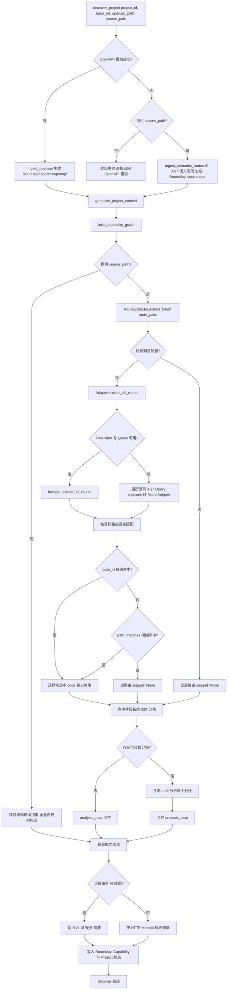
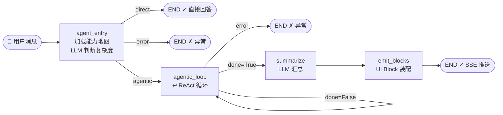
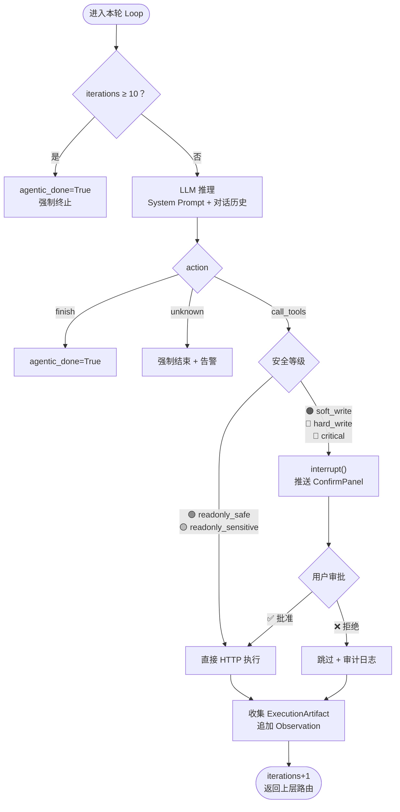
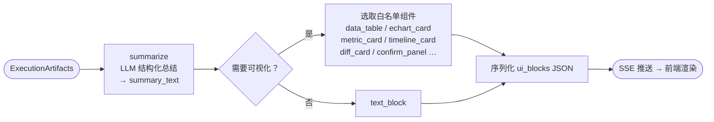

<div align="center">

# LUI-for-All

**用自然语言，操作你的任何系统。**

*Language User Interface · 零更改接入/移除 · 企业级安全*
</div>

---

> 文档语言：**简体中文** | [English](README.en-US.md) | [日本語](README.ja-JP.md)

> 开发者协议文档：[Chat 端点集成协议](CHAT_ENDPOINT_INTEGRATION.md)

## 它解决什么问题？

许多后端系统，尤其是**企业系统、办事系统、专业工作系统**往往功能强大，却极难使用——用户必须深入多级菜单、记住筛选项组合、反复填写表单，才能完成一件本可以用一句话描述的事。

**LUI-for-All** 在你现有系统旁边放一个**独立文件夹，不碰你的一行代码**，就能让用户改用自然语言来操作它：

```
用户：「把上周所有待审批的采购单，按金额从高到低给我列出来，超过五万的高亮标出。」

LUI：[自动识别意图 → 调用现有接口 → 渲染数据表 + 高亮标注]
     ✓ 全程不修改你一行已有代码
```

> 它是一层可控、安全、零侵入的 **自然语言操作层**，架在你现有系统之上。

---

## 核心亮点与创新

### 1. 零侵入接入，无痛移出

整个 LUI 以 **独立文件夹** 形式挂靠在目标项目旁，对已有代码保有严格的 **只读权限**，所有运行时写操作隔离在 `workspace/` 目录内。**想要移除，只需删除这个文件夹**，原系统完全不受影响，零负担尝试接入。

### 2. OpenAPI + Tree-sitter 双轨发现，适配主流后端框架

系统采用“双层发现管线”：

- 第一层：优先摄取目标项目暴露的 `OpenAPI / Swagger` 文档，快速建立标准路由视图
- 第二层：统一 `Tree-sitter AST` 引擎，从源码中定位路由对应的完整 Handler/函数实现

关键能力包括：

- 统一 `FrameAdapter + get_tree_sitter_query()` 协议，适配器可扩展、可插拔
- 内置主流后端适配：Python（FastAPI/Flask/Sanic）、Node.js（NestJS/Express/Fastify）、Java（Spring Boot）、C#（ASP.NET Core）、Go（Gin/Echo/Fiber/chi）
- 当 OpenAPI 不可达或未暴露时，自动降级为 AST 语义路由发现（通过 `source_path`）
- 自动归一化路径参数风格（如 `:id -> {id}`），降低跨框架匹配误差

最终将路由与源码逻辑共同交给 LLM，生成更可靠的能力地图：

- 每条路由自动归属 `domain`（如：财务、用户管理、审批流）
- 每个能力标记最适合的展现组件（`best_modalities`）
- 每个操作预标注安全等级与是否需要人工确认
- 自动打上「是否被前端真实调用」标签，过滤僵尸接口

无需手动维护映射表，**上游接口或源码一旦变化，重新发现即可同步**。

#### 2.1 7 个代表样例的语法派系覆盖

当前仓库已增加 7 个代表测试样例，并通过两级提取测试（路由发现 + 函数实现提取）。

| 代表样例 | 路由风格派系 | 当前适配器覆盖目标（同派系） | 理论可迁移（需新增适配器） |
|---|---|---|---|
| `fastapi_sample` | Python 装饰器路由（`@router.get` / `@app.post`） | FastAPI、Flask、Sanic、Starlette、Litestar、aiohttp、Bottle、Quart | Ruby Sinatra/Grape、PHP Slim |
| `node_sample` | Node 路由调用链（`app.get()` / `router.post()`） | Express、Fastify、Koa Router、Hono、Elysia、Restify | PHP Laravel/Lumen/Slim、Ruby Hanami |
| `django_sample` | URLConf 集中声明（`path/re_path/include`） | Django、Django REST Framework | Ruby on Rails (`routes.rb`)、PHP Laravel (`routes/web.php`) |
| `springboot_sample` | 控制器注解路由（类前缀 + 方法注解） | Java Spring Boot、Spring MVC | C# ASP.NET Core Attribute Controller、PHP Symfony Attribute Route |
| `aspnetcore_sample` | Minimal API 映射（`MapGet/MapPost/MapMethods`） | ASP.NET Core Minimal API | Java Javalin/Spark、Go net/http + mux |
| `go_gin_sample` | 分组链式注册（`Group + METHOD(path, handler)`） | Gin、Echo、Fiber、Chi | Rust Actix/Axum、PHP Slim |
| `node_native_sample` | 无框架命令式分发（`if (method && path)`） | Node.js built-in http | Python wsgiref/werkzeug 命令式分发、Ruby Rack、PHP Swoole 原生分发 |

说明：

- “当前适配器覆盖目标”表示该适配器按 AST 语法模式可覆盖的同派系框架。
- 当前仓库已实测的是 7 个代表样例本身：`backend/test/test_route_extractor_representative_samples.py`。
- “理论可迁移”表示语法结构高度相似，原则上可提取，但需新增或扩展对应适配器后才算正式支持。

#### 2.2 AST 四范式归一

当前发现链路已统一到 4 个 AST 路由范式，7 个代表样例只是“框架语法代表”，不是新增范式：

- `decorator_metadata`: 注解/装饰器元数据路由（FastAPI、Spring、ASP.NET Controller）
- `call_registration`: 调用式注册路由（Express/Fastify、Gin/Echo/Fiber/Chi、ASP.NET Minimal API）
- `route_table`: 集中式路由表（Django URLConf）
- `imperative_dispatch`: 命令式控制流分发（Node native `if/switch`）

这 4 类最终都会统一输出同一 `RouteSnippet` 结构，再进入同一代码切片与 LLM 上下文注入流程。

#### 2.3 探索层完整流程图（含条件分支）



### 3. 8 种白名单 UI 组件，从根源杜绝渲染注入

模型 **永远不允许** 输出原始 HTML / JS / CSS，从根源掐死前端注入攻击的可能性。所有界面元素均通过严格的声明式 JSON 协议下发，前端只渲染以下 8 种白名单组件：

| 组件类型 | 用途 |
|---|---|
| `text_block` | 默认自然语言回答 |
| `metric_card` | 关键指标面板 |
| `data_table` | 可分页数据表 |
| `echart_card` | 配置驱动图表（ECharts） |
| `confirm_panel` | 高危操作审批拦截器 |
| `filter_form` | 参数补充收集 |
| `timeline_card` | 事件序列与流转 |
| `diff_card` | 对照与变化展示 |

灵感源自 Google A2UI 协议，彻底关闭大模型越权渲染的攻击面。

### 4. LangGraph 多层执行内核 + 人工介入审核

核心任务流水线由 LangGraph 编排，具备完整的持久化检查点。

#### 图一：顶层节点路由



#### 图二：agentic_loop 内部（ReAct + 安全裁定）



#### 图三：收尾链路（summarize → emit_blocks）



**5 级安全**：`readonly_safe` → `readonly_sensitive` → `soft_write` → `hard_write` → `critical`，任何写操作均通过 LangGraph `interrupt()` 硬性暂停，前端唤出 `ConfirmPanel`，用户确认后 Graph 从断点恢复，拒绝则跳过并记录审计日志。

### 5. AG-UI 协议 + SSE 实时事件流

前后端通信基于 Server-Sent Events，完整实现 AG-UI 事件流协议：
- LangGraph 每个节点的进度实时推送到前端
- 思考内容（Reasoning）流式显示，可折叠
- 审批节点触发时，前端自动唤出 `ConfirmPanel`，无需轮询

### 6. 全链路 OpenTelemetry 可观测

每一次对话，从用户输入到最终渲染，全链路注入统一 `Trace ID`：
- FastAPI 请求层
- LangGraph 节点执行层
- HTTP 执行器层

不是黑盒，每一步决策均可溯源审计。

### 7. Agent Matchbox 多模型网关

内置 **Agent Matchbox** 多模型路由网关，支持多平台 LLM 统一调度、Token 配额管理与用量统计，切换模型无需改动业务代码。

### 8. Docker / 裸机双环境自动连通

- 导入示例项目时，系统会自动识别运行环境并选择可达地址：
    - Docker 内优先使用容器服务名（如 `sample-fastapi:8010`）
    - 本机运行优先使用 `localhost` 端口
- 连通性测试与路由拉取接口支持 `source_path`，在 OpenAPI 不可用时自动切换 AST 发现，导入流程不再被单点阻塞

### 9. Chat 端点可插拔前端协议（支持自定义 GUI）

LUI-for-All 将“聊天能力内核”与“前端呈现层”解耦：

- 开发者可直接对接 `chat` 端点，替换现有前端 UI，而无需改动后端执行链路
- 协议完整覆盖当前前端元素：AI 工作进度、HTTP 调用记录、审批请求/审批记录、AI 思考流、8 类 UI Block
- 数据类型边界清晰：流式事件走 SSE，历史/审计回放走普通 JSON 接口

详细字段与事件清单见：[Chat 端点集成协议](CHAT_ENDPOINT_INTEGRATION.md)

### 10. 通过 MCP 与 OpenClaw 联动（跨渠道执行入口）

OpenClaw 的最大价值，是把自然语言直接变成可持续执行的自动化，不需要人盯着它一步一步点。你只要下指令，它就能在自己的电脑、账号和渠道里持续跑下去，做真正的无人值守任务。

和 LUI-for-All 联动后，价值会更直接：

- OpenClaw 负责无人值守的自然语言自动化，LUI-for-All 负责把动作落到具体专属项目里
- 用户可以直接在 OpenClaw 里下自然语言任务，再通过 LUI 的 MCP 接口深入项目内部的页面、接口和工作流
- 我们保留安全分级、人工确认、SSE 进度和 HTTP 调用记录，既能放手自动跑，也能追踪每一步

接入步骤很简单：

1. 启动 OpenClaw，让它先作为自然语言自动化入口跑起来
2. 在 OpenClaw 侧把 LUI-for-All 配成 MCP 工具，或者把 OpenClaw 会话桥接到 MCP 客户端
3. 在 LUI-for-All 里配置 MCP 访问令牌和网关地址，让 OpenClaw 能碰到你的专属项目
4. 先用一个只读能力做联调，再逐步接入有审批的业务操作

---

## 快速开始

### 环境要求

- Python 3.11+（推荐 Conda 管理）
- Node.js 18+ + pnpm 10
- 推荐目标项目暴露 OpenAPI 文档（`/openapi.json` 或文件路径）
- 若未暴露 OpenAPI，需提供可访问源码路径（`source_path`）以启用 AST 路由发现

### 1. 克隆项目

```bash
git clone https://github.com/your-org/lui-for-all.git
cd lui-for-all
```

### 2. 后端安装

```bash
# 创建并激活 Conda 环境
conda create -n lui python=3.11 -y
conda activate lui

# 安装依赖
pip install -r backend/requirements.txt

# 复制配置文件
cp backend/.env.example backend/.env
# 编辑 .env，填写 LLM API Key 和目标项目地址
```

### 3. 前端安装

```bash
cd frontend
pnpm install
```

### 4. 启动服务

```bash
# 终端 1：启动后端
cd backend
conda run -n lui uvicorn app.main:app --reload --port 6689

# 终端 2：启动前端
cd frontend
pnpm dev
```

### 5. 接入你的第一个项目

打开 `http://localhost:5173`，点击「新建项目」，优先填写 OpenAPI 地址（如 `http://your-app/openapi.json`）。

如果目标系统没有暴露 OpenAPI，也可以仅提供源码路径 `source_path`，系统会自动切换为 AST 语义发现并继续建图。

系统将自动完成能力发现与建模，通常耗时 10-30 秒。

完成后，在对话框中直接用自然语言向你的系统提问。

---

## 技术架构

```
┌─────────────────────────────────────────────────────────────┐
│                    前端 (Vue 3 + Vite)                       │
│  ChatPage  ProjectsPage  SettingsPage                       │
│  SSE 事件流 ──── AG-UI 协议 ──── UI Block 渲染器              │
└──────────────────────┬──────────────────────────────────────┘
                       │ HTTP / SSE
┌──────────────────────▼──────────────────────────────────────┐
│                  后端 (FastAPI)                               │
│  /api/chat  /api/sessions  /api/projects  /api/settings     │
│       │                │                                     │
│  LangGraph 编排器    Project Modeler                         │
│  ┌────────────┐      ┌──────────────────────────┐           │
│  │ 意图解析节点│      │ OpenAPI + AST 路由发现     │           │
│  │ 能力路由节点│      │ 能力建模与语义聚类         │           │
│  │ 规划节点   │      │ 能力地图持久化             │           │
│  │ 安全裁定节点│      └──────────────────────────┘           │
│  │ HTTP执行节点│                                              │
│  │ 汇总渲染节点│  ←── Agent Matchbox (多模型网关)             │
│  └────────────┘                                              │
│       │                                                      │
│  SQLite (lui.db + checkpoints.db)                           │
└─────────────────────────────────────────────────────────────┘
```

### 关键目录结构

```
lui-for-all/
├── backend/
│   ├── app/
│   │   ├── api/           # FastAPI 路由层 (chat, projects, sessions, settings)
│   │   ├── graph/         # LangGraph 状态机定义
│   │   ├── orchestrator/  # 任务编排状态与节点
│   │   ├── discovery/     # OpenAPI 摄取与能力建模
│   │   ├── runtime/       # SSE 事件发射器
│   │   ├── llm/           # Agent Matchbox 网关 + 提示词
│   │   ├── models/        # SQLAlchemy ORM 模型
│   │   └── schemas/       # Pydantic 数据契约
│   └── requirements.txt
├── frontend/
│   ├── src/
│   │   ├── views/         # ChatPage, ProjectsPage
│   │   ├── stores/        # Pinia 状态 (session, project)
│   │   ├── components/    # UI Block 渲染组件
│   │   └── api/           # HTTP / SSE 客户端
│   └── package.json
├── workspace/             # 运行时隔离沙箱（自动生成）
│   ├── lui.db
│   └── checkpoints.db
└── LUI-for-all_Execution_Plan.md
```

---

## 设计边界

| LUI-for-All 是什么 | LUI-for-All 不是什么 |
|---|---|
| ✅ 自然语言操作层 | ❌ 简易API to MCP |
| ✅ 接口能力编排器 | ❌ RPA / GUI 点选自动化 |
| ✅ 只读安全默认，写操作需审批 | ❌ 无安全界限 CRUD 的系统 |
| ✅ 声明式 UI Block 增强回答 | ❌ 前端重写器 / 低代码生成器 |
| ✅ 零侵入挂靠在已有系统旁 | ❌ 替换、侵入已有系统 |

---

## 路线图

- [x] MVP：FastAPI + LangGraph 核心流水线
- [x] OpenAPI 能力自动发现与建模
- [x] 8 种 UI Block 白名单组件
- [x] AG-UI SSE 协议 + 实时流
- [x] 人工确认（Human-in-the-loop）拦截器
- [x] Agent Matchbox 多模型网关
- [x] Tree-sitter AST 语义路由解析（支持无 OpenAPI）
- [ ] 能力地图可视化管理界面
- [ ] 多租户与权限体系
- [ ] 私有化部署文档

---

<div align="center">

*让语言成为界面。*

</div>