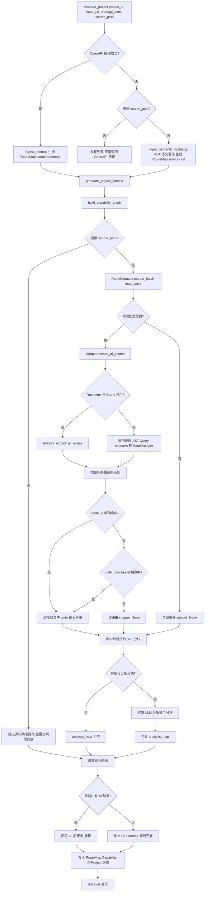

# 框架适配器贡献指南

> 本文档面向所有希望为 **lui-for-all** 增加新后端框架/语言支持的开发者。
> 阅读完本文，你将能够独立完成一个新适配器的开发与集成。

---

## 1. 什么是框架适配器？

当 lui-for-all 扫描一个后端项目时，它会：

1. 通过 OpenAPI 文档获取完整的路由列表（`/api/users`, `POST /api/orders` 等）
2. **根据每条路由，在项目源码中定位对应的函数/方法实现**
3. 将源码片段提交给 AI 分析，生成高质量的能力描述

步骤 2 正是框架适配器（`FrameAdapter`）负责的事情。

不同框架的路由定义方式差异很大：

| 框架 | 路由定义风格 |
|------|------------|
| FastAPI / Flask | Python 装饰器 `@router.get("/path")` |
| NestJS | TypeScript 装饰器 `@Get('/path')` |
| Express / Fastify | 函数式 `router.get('/path', handler)` |
| Django | `urls.py` 集中配置 `path('users/', views.list)` |
| Spring Boot | Java 注解 `@GetMapping("/path")` |
| Gin (Go) | 函数链式 `r.GET("/path", handler)` |
| 原生 HTTP | 无框架，直接解析 `req.url` 判断路由 |

每种风格都需要专门的适配器来识别和提取。

### 1.1 当前探索层完整流程（含条件分支）



---

## 2. 快速开始（5 步完成一个适配器）

### 步骤 1：新建适配器文件

在 `backend/app/discovery/adapters/` 目录下创建新文件，
文件名建议格式：`{语言}_{框架}.py`，例如：

```
adapters/
├── java_spring_boot.py   ← 你的新文件
├── go_gin.py
├── csharp_aspnet.py
└── ...
```

### 步骤 2：继承 FrameAdapter（Tree-sitter 协议）

```python
from pathlib import Path
from typing import Any

from app.discovery.adapters.base import FrameAdapter, RouteSnippet
from app.discovery.adapters.paradigms import AST_PARADIGM_DECORATOR_METADATA

class SpringBootAdapter(FrameAdapter):
    NAME = "spring_boot"  # 全局唯一标识，全小写
    LANGUAGES = [".java"]
    TREE_SITTER_LANGUAGES = ["java"]
    AST_PARADIGMS = [AST_PARADIGM_DECORATOR_METADATA]
    SUPPORTED_FRAMEWORKS = ["spring-boot", "spring-mvc"]

    @classmethod
    def can_handle(cls, source_path: Path) -> bool:
        # 判断该目录是否是 Spring 项目
        ...

    def get_tree_sitter_query(self) -> str:
        # 返回本适配器的 Query
        return """
        (marker_annotation name: (identifier) @route.decorator)
        """

    def _extract_routes_from_tree(
        self,
        source_file: Path,
        source_bytes: bytes,
        root_node: Any,
        captures: list[tuple[Any, str]],
    ) -> list[RouteSnippet]:
        # 从 captures 组装 RouteSnippet
        ...
```

### 步骤 3：注册适配器

打开 `adapters/__init__.py`，在 `_REGISTRY` 列表末尾追加你的类：

```python
from app.discovery.adapters.java_spring_boot import SpringBootAdapter

_REGISTRY: list[type[FrameAdapter]] = [
    PythonDecoratorAdapter,
    NodejsTypescriptAdapter,
    SpringBootAdapter,   # ← 追加在此
]
```

### 步骤 4：验证自动检测

```python
from app.discovery.adapters import get_adapter

adapter = get_adapter("/path/to/your/spring-boot-project")
print(adapter)
# 期望输出: <FrameAdapter:spring_boot @ /path/to/...>
```

### 步骤 5：验证路由提取

优先验证批量提取（更贴近生产路径），确认返回 `RouteSnippet.code` 包含正确实现：

```python
result = adapter.extract_batch([
    ("GET", "/api/users"),
    ("POST", "/api/users"),
])

snippet = result["GET:/api/users"]
print(snippet.code if snippet else "not found")
```

---

## 3. FrameAdapter 接口详解（当前实现）

### 3.1 must-have：`can_handle(source_path)`

**作用**：让注册表自动判断你的适配器是否适用于目标项目。

**推荐检测策略（按可靠性排序）**：

```python
@classmethod
def can_handle(cls, source_path: Path) -> bool:
    # 策略1：特征文件存在（最可靠）
    if (source_path / "pom.xml").exists():
        return True

    # 策略2：依赖文件中包含框架名称
    build_gradle = source_path / "build.gradle"
    if build_gradle.exists():
        content = build_gradle.read_text(errors="ignore").lower()
        if "spring-boot" in content:
            return True

    # 策略3：源码中存在特定语法模式（扫描少量文件）
    for java_file in list(source_path.rglob("*.java"))[:20]:
        content = java_file.read_text(errors="ignore")
        if "@GetMapping" in content or "@PostMapping" in content:
            return True

    return False
```

**注意**：`can_handle()` 是 `@classmethod`，不要在其中访问 `self`。

---

### 3.2 must-have：`get_tree_sitter_query()`

**作用**：声明适配器的 Tree-sitter Query，用于抓取候选路由节点。

建议：
1. Query 尽量只抓“路由相关节点”，避免抓太大范围导致误报
2. capture 命名语义化，如 `@route.decorator`、`@route.call`、`@route.path`

---

### 3.3 must-have：`_extract_routes_from_tree(...)`

**作用**：将 Query captures 还原成标准 `RouteSnippet` 列表。

你需要完成：
1. 从 captures 中解析 method/path/handler 节点
2. 用 `self._make_snippet(...)` 统一生成 `RouteSnippet`
3. 返回本文件中识别到的所有路由片段

说明：
- 生产路径默认先 `extract_all_routes()`，再由基类 `extract_batch()` 做精确/模糊匹配。
- 你通常不需要自己实现 `extract_route()`。

---

### 3.4 optional：`_fallback_extract_all_routes()`

当 Tree-sitter 不可用或 Query 编译失败时，基类会调用该降级方法。
默认返回空列表；如有必要可提供轻量 regex 降级实现。

---

### 3.5 optional：`extract_batch(routes)`

基类默认实现已经是“单次全量发现 + route_id 精确匹配 + path_matches 模糊匹配”。
仅在你确认可以显著优化性能时再覆盖。

---

## 4. 共享工具函数（`base.py` 提供）

无需重复实现，直接 import 使用：

```python
from app.discovery.adapters.base import (
    path_matches,           # 模糊路径匹配
    iter_source_files,      # 通用文件遍历
    normalize_param_to_regex,  # 路径参数 → 正则
)
```

### `path_matches(code_path, openapi_path) -> bool`

模糊路径匹配，自动处理：
- 框架 prefix 被路由组/Controller 吸收（后缀匹配）
- `:param`（Express/Go）和 `{param}`（OpenAPI）的互相兼容

```python
path_matches("/users/{id}", "/api/v1/users/{id}")  # True（前缀省略）
path_matches(":id",         "/api/v1/users/{id}")  # True（极简后缀）
path_matches("/orders",     "/api/v1/users/{id}")  # False
```

### `iter_source_files(source_path, extensions, exclude_dirs)`

通用文件迭代，自动跳过 `node_modules`、`.git`、`dist`、`build` 等噪音目录。

```python
for java_file in iter_source_files(self.source_path, {".java"}):
    content = java_file.read_text(encoding="utf-8", errors="replace")
```

### `normalize_param_to_regex(path) -> str`

```python
normalize_param_to_regex("/users/{id}/posts")  # → r"/users/[^/]+/posts"
normalize_param_to_regex("/users/:id/posts")   # → r"/users/[^/]+/posts"
```

---

## 5. 各语言/框架路由风格速查

贡献对应框架的适配器时，可参考以下路由定义模式：

### Python

| 框架 | 路由定义 | 提取难度 |
|------|---------|--------|
| FastAPI | `@router.get("/path")` | ⭐ 已实现 |
| Flask | `@app.route("/path", methods=["GET"])` | ⭐ 已实现 |
| Sanic | `@app.get("/path")` | ⭐ 已实现（同装饰器适配器）|
| Django | `path("users/", views.user_list)` in `urls.py` | ⭐⭐⭐ 已实现 |

### TypeScript / JavaScript

| 框架 | 路由定义 | 提取难度 |
|------|---------|--------|
| NestJS | `@Get('/path')` on class method | ⭐⭐ 已实现 |
| Express | `router.get('/path', handler)` | ⭐ 已实现 |
| Fastify | `fastify.get('/path', handler)` | ⭐ 已实现 |
| Hono | `app.get('/path', handler)` | ⭐ 同 Express 适配器可兼容 |
| Koa + @koa/router | `router.get('/path', ctx => {...})` | ⭐ 同 Express 适配器可兼容 |
| 原生 Node.js HTTP | `if (req.url === '/path' && req.method === 'GET')` | ⭐⭐ 已实现（imperative_dispatch） |

### Java

| 框架 | 路由定义 | 提取难度 |
|------|---------|--------|
| Spring Boot | `@GetMapping("/path")` on method | ⭐⭐ 已实现 |
| Quarkus | `@GET @Path("/path")` | ⭐⭐ 待贡献 |
| Micronaut | `@Get("/path")` | ⭐⭐ 待贡献 |

### Go

| 框架 | 路由定义 | 提取难度 |
|------|---------|--------|
| Gin | `r.GET("/path", handler)` | ⭐⭐ 已实现 |
| Echo | `e.GET("/path", handler)` | ⭐⭐ 已实现 |
| Fiber | `app.Get("/path", handler)` | ⭐⭐ 已实现 |
| chi | `r.Get("/path", handler)` | ⭐⭐ 已实现 |
| 原生 `net/http` | `http.HandleFunc("/path", handler)` | ⭐ 待贡献 |

### C# / .NET

| 框架 | 路由定义 | 提取难度 |
|------|---------|--------|
| ASP.NET Core | `[HttpGet("/path")]` | ⭐⭐ 已实现 |
| Minimal API | `app.MapGet("/path", handler)` | ⭐ 已实现 |

### Ruby

| 框架 | 路由定义 | 提取难度 |
|------|---------|--------|
| Rails | `get '/path', to: 'controller#action'` in `routes.rb` | ⭐⭐⭐ 待贡献 |
| Sinatra | `get '/path' do ... end` | ⭐⭐ 待贡献 |

### PHP

| 框架 | 路由定义 | 提取难度 |
|------|---------|--------|
| Laravel | `Route::get('/path', [Controller::class, 'method'])` | ⭐⭐ 待贡献 |
| Slim | `$app->get('/path', function($req, $res) {...})` | ⭐⭐ 待贡献 |

---

## 6. 原生 HTTP 适配器说明

即使不使用任何框架，也可以编写适配器支持原生 HTTP 端点。
常见模式有三种，适配时需逐一处理：

**模式1：URL 字符串直接比较**
```python
if request.path == "/api/users" and request.method == "GET":
    ...
```

**模式2：正则路由表**
```python
routes = [
    (re.compile(r"^/api/users/(\d+)$"), "GET", get_user),
]
```

**模式3：字典/映射路由表**
```python
ROUTES = {
    ("GET", "/api/users"): handle_list_users,
    ("POST", "/api/users"): handle_create_user,
}
```

适配器可以扫描这些模式，`can_handle()` 可以通过判断"依赖文件中没有框架"
且"源码中存在 URL 字符串比较逻辑"来启用。

---

## 7. 提取难度评级说明

- ⭐ **简单**：路由注册在同一行，函数体紧随其后，正则+缩进/大括号计数即可
- ⭐⭐ **中等**：路由和实现分两层（装饰器+类方法、注解+方法），需向前/向后窗口扫描
- ⭐⭐⭐ **复杂**：路由注册与实现在不同文件（如 Django urls.py），需要跨文件解析

对于 ⭐⭐⭐ 难度的框架，建议先实现 `can_handle()`、`get_tree_sitter_query()` 与
`_extract_routes_from_tree()` 的最小骨架，即使暂时无法完整覆盖所有路由，
也能让系统识别框架类型并给出可诊断日志，便于后续迭代完善。
