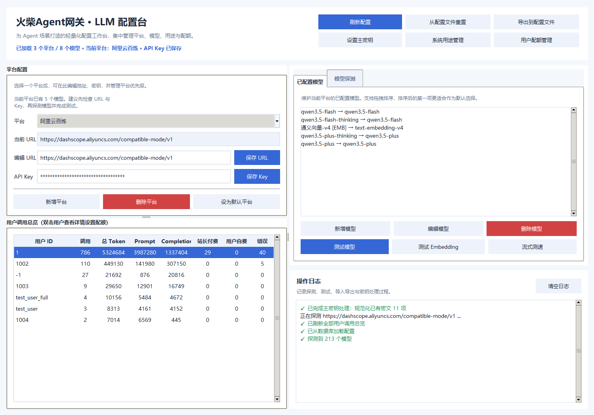

# 火柴Agent网关——为Agent而生的全功能大模型网关


火柴Agent网关面向 Agent 开发而生，是一个功能强大且极其灵活的大模型路由与配额控制中心。**它轻量、无需部署，深度融入到 agent 开发管理中**。它面向当今最专业、最通用的 Agent 编排框架**LangChain/LangGraph**，但**可以非常轻松的迁移至AutoGen、CrewAI等其他同样强大的Agent框架**，仅需对你的Coding Assistant说一句话即可适配你的框架。

该项目的设计目标是支持从个人开发、调试到多用户生产环境的多种复杂场景，并提供了一个图形化界面来简化核心配置的管理。

> 💡 **为什么叫“火柴”？**
> 火柴是点燃智能之火的原材料。在这个 AI 普惠的时代，构建各类 AI 应用的站长们就像是一个个“卖火柴的小女孩”（~~Token滞销，请帮帮我们~~）。


### 🔥 为什么选择内置网关？

专门的外置网关（如 NewAPI、LiteLLM 等）虽然强大，但在与复杂的应用直接结合时往往存在体验断层。本管理器作为**内置网关**，具备以下独特优势：

1. **直接融合 Agent 编排生态**：
   内置网关直接工作在应用代码层。它可以无缝传递 Agent 编排过程中的上下文、工具调用（Function Calling）定义、甚至特殊的结构化输出格式。有效避免了外部网关转发多跳造成的网络延迟与长链接中断，并且彻底杜绝了外置网关代理流式响应时的协议兼容性折损问题。
2. **灵活支持“系统托管”与“用户自定义 (BYOK)”**：
   完美支持商业化与 C 端用户的多租户场景。既可以由**系统托管**（管理员全局配置大模型池，用户开箱即用），也支持用户**自定义 (Bring Your Own Key)**。用户数据的加密隔离直接在应用内完成，无需去另一个独立的网关系统去繁琐地同步创建账户、下发 Token。
3. **原生级别的多口径配额管理 (Quota)**：
   内嵌完整的配额限流机制。系统直接挂靠应用本身的 User ID，清晰且自动地区分“系统付费”（消耗站长托管 Key）和“用户自费”（BYOK），两条配额口径独立管理。应用层可以在请求发往原厂前瞬间完成精确拦截验证。
4. **统一运维，极简一致**：
   无需额外额署 Redis 或是配置复杂的 OneAPI Docker 容器。计费、审计、模型管理、用量统计全部在这个服务内通过内置的 SQLite / SQLAlchemy 优雅搞定，大幅降低了本地开发调试和私有化部署的心智负担。

## ✨ 核心特性

- **多种运行模式**：
  - **无用户/全局单用户模式**：适用于后端服务、个人工具或开发调试，所有请求共享一套由环境变量配置的系统级LLM。
  - **多用户固定平台模式**：适用于需要保证模型质量和来源的场景。所有用户共享系统预设的平台，但可以使用自己的API Key。
  - **多用户自定义平台模式**：提供最大灵活性，允许每个用户自由添加、管理自己的LLM平台和模型。
- **统一的接口**：无论后端配置如何变化，开发者都可以通过 `matchbox().get_user_llm(user_id, usage_key="fast")` 获取对应用户/用途的 LLM 实例。
- **智能推理流适配（拒绝空等待）**：网关**兼容 Open AI 协议**，并支持动态探测和自动将各种常见的推理字段（如 `reasoning_content` 和 `<think>` 标签）**统一转化为持续的推理流**，确保深度思考模型在运转时前端依然能拥有极佳的纯流式体验。
- **多用途选中模型**：为每个用户维护“主模型 / 快速模型 / 推理模型”等多个用途槽位，并允许用户自定义新的用途，按需绑定不同模型。
- **系统与用户隔离**：明确区分“系统平台”和“用户私有平台”，系统平台由配置文件 (`llm_mgr_cfg.yaml`) 统一管理，用户平台数据则存储在数据库中。
- **灵活的密钥管理**：
  - 强烈推荐使用**环境变量**来管理API Key，避免密钥硬编码，提高安全性。
  - 支持用户为共享的系统平台提供自己的API Key，从而分摊成本。
  - 提供 `LLM_AUTO_KEY` 选项，允许在用户未提供密钥时，自动降级使用服务器的密钥（需谨慎使用）。
- **按资金来源拆分的配额机制**：
  - 调用会自动区分为 `sys_paid`（消耗站长托管 Key）和 `self_paid`（消耗用户自己的 Key）。
  - 两条口径都支持“每 N 小时配额”和“总配额”，并在实际发起 LLM 请求前执行拦截。
- **动态模型探测**：内置独立的模型探测工具 (`probe_platform_models`)，可以探测任何兼容OpenAI接口的平台所支持的模型列表。
  - **推理内容/计费字段可视化（平台测试）**：GUI 的“测试模型”会展示原始响应 JSON，部分平台会返回 `reasoning_content`、`usage` 或 `billing` 相关字段，可直接在日志中查看。
  - **图形化配置工具**：提供一个基于 `Tkinter` 的 GUI 工具（`llm_mgr_cfg_gui.py`），完全无需依赖前端配置，**直接操作数据库**，支持添加/编辑/删除平台与模型、加密存储 API Key、探测和测试模型，以及从配置文件重置数据库或将数据库导出到 YAML。
- **数据库持久化**：使用 SQLite 存储用户配置、平台和模型信息，数据持久可靠。
- **自动配置修正**：当用户的配置失效（如模型或平台被删除），系统会自动回退到第一个可用的默认平台，保证服务的可用性。

## 📂 文件结构

```
.
├── __init__.py            # 包入口，导出 initialize_matchbox / matchbox / create_matchbox
├── manager.py             # AIManager 核心类（组合所有 Mixin）
├── config.py              # 配置加载与全局常量 (USE_SYS_LLM_CONFIG, LLM_AUTO_KEY 等)
├── models.py              # SQLAlchemy 数据库模型
├── security.py            # 安全与加密 (SecurityManager)
├── admin.py               # 平台与模型管理 Mixin (AdminMixin)
├── builder.py             # LLM 实例构建 Mixin (LLMBuilderMixin)
├── user_services.py       # 用户服务 Mixin (UserServicesMixin)
├── quota_services.py      # 配额配置/统计/拦截 Mixin (QuotaServicesMixin)
├── usage_services.py      # 用量统计 Mixin (UsageServicesMixin)
├── tracked_model.py       # LLMClient/LLMUsage/UsageTrackingCallback
├── estimate_tokens.py     # Token 用量估算工具
├── utils.py               # 工具函数 (probe_platform_models, parse_extra_body 等)
├── llm_mgr_cfg.yaml       # 系统平台预设配置（仅用于初始化/导出，运行时以数据库为准）
├── llm_mgr_cfg_gui.py     # 图形化配置管理工具（入口，实际代码在 gui/ 子目录）
├── gui/                   # GUI 模块（拆分自 llm_mgr_cfg_gui.py）
│   ├── __init__.py
│   ├── main_window.py     # 主窗口 LLMConfigGUI 类（平台配置、用户总览、模型管理）
│   ├── platform_panel.py  # 平台管理 Mixin
│   ├── model_panel.py     # 模型管理 Mixin
│   ├── dialogs.py         # 对话框 Mixin（添加/编辑模型、系统用途槽、用户配额）
│   ├── key_manager.py     # 密钥管理 Mixin
│   ├── testing.py         # 测试功能 Mixin
│   ├── dpi.py             # 高分屏适配与窗口尺寸策略
│   └── theme.py           # GUI 主题、配色与表格样式
├── llm_config.db          # (自动生成) SQLite 数据库文件
└── README.md              # 本文档
```

- **`manager.py`**: 包含 `AIManager` 类，通过 Mixin 模式组合了 `AdminMixin`、`LLMBuilderMixin`、`UserServicesMixin`、`QuotaServicesMixin`、`UsageServicesMixin` 等功能模块。这是与程序交互的主要入口。
- **`quota_services.py`**: 配额服务模块，集中处理 `sys_paid/self_paid` 两条计费口径的配额配置、周期用量统计、总量统计与调用前拦截。
- **`usage_services.py`**: 用量统计模块，除单用户汇总外，也提供面向 GUI 的全用户调用总览聚合能力。
- **`llm_mgr_cfg.yaml`**: **初始化配置文件**。用于定义初始的"系统平台"。首次启动时，管理器会将此文件中的平台同步到数据库。后续启动仅增量添加新平台，不会覆盖已有配置。**运行时权威数据源是数据库，而非此文件。**
- **`llm_mgr_cfg_gui.py`**: GUI 入口文件，实际逻辑拆分在 `gui/` 子目录中。**直接操作数据库**，支持平台/模型增删改、API Key 加密存储、模型探测与测试、全用户调用总览、双击用户查看详情，以及从配置文件重置数据库或将数据库导出到 YAML。

## 🛠️ 第一次配置流程 (新手必读)

**注意：** 项目自带的配置文件 (`llm_mgr_cfg.yaml`) 适用于快速迁移或者分享自己模型配置的，但其中的 API Key 是无效的（为了保护站长密钥而进行加密，同时满足分享和快速部署的需求）。

首次使用时，你需要运行配置工具，填入你自己的 API Key。

1. **设置主加密密钥 (LLM_KEY)**：
    - 系统使用 `LLM_KEY` 加密你的 API Key和所有用户自定义的API Key。你可以设置环境变量，或者直接运行 GUI 工具，它会提示你输入并自动保存。
    - **首次部署时若你看到“存在历史密钥无法解密”的提示，不必惊慌。** 这通常意味着 `llm_mgr_cfg.yaml` 中携带了仓库作者或其他环境生成的加密 Key，它们在你的机器上本来就不可用。此时你只需要设置自己的 `LLM_KEY`，并按提示选择清理这些不可恢复密钥即可。**清理不会删除平台与模型结构，只会清空这些不可用的托管 Key。**

2. **启动配置工具**：
    - 在终端进入 `server/llm/agen_matchbox` 目录，运行 `python llm_mgr_cfg_gui.py`。
    - 你会看到预置的平台（如 DeepSeek, OpenRouter），但它们的 Key 是无法使用的。

3. **替换并激活平台**：
    - 选中你打算使用的平台，在右侧填入你的真实 **API Key** 并点击保存。
    - 对于不需要的平台，建议直接删除。

4. **验证模型**：
    - 点击 **“探测可用模型”**。如果配置正确，右侧会列出该平台支持的所有模型。
    - 在左侧选中一个模型，点击 **“测试模型”**，看到“测试成功”即表示配置完成。

5. **检查用途绑定**：
    - 点击 **“系统用途管理”**。
    - 确保 `main` (主模型)、`fast` (快速模型)、`reason` (推理模型) 绑定的模型是你刚刚配置过 Key 的有效模型。

6. **最终测试**：
    - 在左侧选中一个模型，点击 **“测试模型”**。
    - 如果看到“测试成功”的日志，说明配置已完成！

## ⚙️ 核心概念与运行模式

理解本项目的运行模式至关重要，这直接影响到功能的表现和二次开发。

### 标准设计（推荐）

为兼顾稳定性、可维护性和扩展自由度，火柴网关采用双通道标准设计：

1. **管理通道（默认）**：
  - 启动阶段显式调用 `initialize_matchbox(ensure_defaults=True)`，统一完成默认配置同步。
  - 请求阶段统一通过 `matchbox()` 获取管理器，再调用 `get_user_llm(...)` / `get_user_embedding(...)`。
  - 自动处理用户选型、密钥优先级、配额拦截与用量统计。
2. **轻量通道（旁路）**：
  - 使用 `create_quick_llm(...)` / `create_quick_embedding(...)` 快速创建客户端。
  - 不依赖数据库，适合脚本、工具链、临时任务和外部接入。
3. **生命周期约束**：
  - 启动初始化，关闭阶段调用 `reset_matchbo()`，避免导入即初始化的副作用。
4. **运行目录治理**：
  - 通过 `AGENT_MATCHBOX_HOME` 统一指定 DB/.env/YAML/state 的运行位置。

### 推荐链路（开发者实践）

```python
from llm.agen_matchbox import initialize_matchbox, matchbox

# 1) 在应用启动阶段执行一次
initialize_matchbox(ensure_defaults=True)

# 2) 在业务请求中按需获取（默认 required=True）
client = matchbox().get_user_llm(user_id="user_123", usage_key="main", agent_name="agent_director")

# 3) 像普通 LLM 一样使用
result = client.invoke("请给我一个赛博朋克世界观种子")

# 4) 流式同样可用，且会自动完成用量归档
for chunk in client.stream("继续扩展成三幕结构"):
    print(chunk.content, end="")
```

### 1. 系统用户 (`SYSTEM_USER_ID = "-1"`)

这是一个特殊的虚拟用户ID。当代码中使用 `matchbox().get_user_llm()` (不带 `user_id` 参数) 或 `matchbox().get_user_llm(user_id="-1")` 时，管理器会进入**系统模式**。

- **目的**：为应用后端、全局服务或开发调试提供一个统一的LLM实例。
- **密钥来源**：系统模式下优先使用用户对系统平台配置的专属 Key；未配置时按 `LLM_AUTO_KEY` 规则回退到系统后备 Key。当前实现中，系统后备 Key 来自 `DEFAULT_PLATFORM_CONFIGS`（即 `llm_mgr_cfg.yaml` / 环境变量解析结果）。

### 2. 全局模式开关

在 [`config.py`](config.py) 中有两个重要的全局开关：

- **`USE_SYS_LLM_CONFIG = True` (多用户固定平台模式)**
  - 所有用户都只能看到和使用 `llm_mgr_cfg.yaml` 中定义的系统平台。
  - 用户**不能**创建、修改或删除自己的平台和模型。
  - 用户**可以**为这些系统平台提供自己的API Key，这些Key会安全地存储在数据库的 `llm_sys_platform_keys` 表中，与用户ID关联。
  - 这种模式兼顾了模型的统一管理和成本的分摊。

- **`USE_SYS_LLM_CONFIG = False` (多用户自定义平台模式)**
  - 这是**默认**的模式。
  - 此模式下，用户拥有最大权限。
  - **系统平台依然可见且可用**，但用户获得了“写权限”。
  - 用户可以通过调用 `AIManager` 的 `add_platform`, `add_model` 等方法来创建自己的私有平台和模型。
  - 适用于需要高度自定义的场景。

### 3. 自动密钥降级与优先级 (`LLM_AUTO_KEY`)

系统在获取 API Key 时遵循 **“用户私有 > 系统后备”** 的原则：

1. **用户私有密钥**：如果用户为某个系统平台设置了专属 Key（存储在数据库中），则优先使用。
2. **系统后备密钥**：只有当用户未设置 Key 时，系统才会检查 `LLM_AUTO_KEY`。

- **`LLM_AUTO_KEY = True`**
  - **⚠️这是一个需要特别注意的选项！**
    - 当一个普通用户使用一个**系统平台**但没有提供自己的 API Key 时，如果此选项为 `True`，管理器会自动回退并使用系统后备 Key（当前实现来自 `DEFAULT_PLATFORM_CONFIGS` 的解析结果）作为后备 API Key。
  - **优点**：可以为免费用户或未配置的用户提供体验。
  - **风险**：**可能会导致服务器成本意外增加！** 如果你不想为用户免费提供服务，请务必将此项设置为 `False`。

- **`LLM_AUTO_KEY = False`**
  - 更安全的选项。
  - 如果用户没有为系统平台提供自己的API Key，在调用LLM时会直接抛出 `ValueError`，提示用户需要配置API Key。

**推荐设置**：

- 如果你希望 **服务器为用户提供统一服务并承担费用**（即"我固定死所有的模型然后给所有用户提供 API 服务"），请将 `LLM_AUTO_KEY = True`，并通过 GUI 为系统默认平台配置 API Key（由管理员支付）。
- 如果你希望 **用户必须使用自己的 Key 并付费**（即“我固定死所有模型但用户自己给 API 付钱”），请将 `LLM_AUTO_KEY = False`，并在前端或用户设置中要求用户填写他们的 API Key。

### 4. 配额口径与拦截

当前版本已把所有调用按**实际命中的密钥来源**拆成两条计费/配额口径：

- **`sys_paid`**：系统平台 + 站长托管 Key
- **`self_paid`**：用户自己的 Key
  - 包括系统平台上的用户 override Key
  - 也包括用户自定义平台自己的 Key

这样做的目的是：

- 站长希望限制自己承担费用的调用时，只限制 `sys_paid`
- 用户即使把 `sys_paid` 用完，只要切到自己的 Key，仍然可以继续使用 `self_paid`
- 不会因为站长额度耗尽而误伤用户自己的自费通道

配额配置存储在 `user_quota_policies` 表中，支持两条口径分别配置：

- **每 N 小时窗口周期配额**
  - `*_window_hours`
  - `*_window_token_limit`
  - `*_window_request_limit`
- **总配额**
  - `*_total_token_limit`
  - `*_total_request_limit`

所有字段都允许为空；为空表示该项限制未启用。

运行时拦截逻辑如下：

1. `matchbox().get_user_llm(...)` / `matchbox().get_spec_sys_llm(...)` 先解析本次调用实际命中的 Key。
2. 系统根据当前调用得到 `sys_paid` 或 `self_paid`。
3. 仅检查当前口径对应的配额。
4. 若超额，则抛出 `QuotaExceededError`。

### 5. 多用途模型槽

- **默认用途**：系统会为每个用户自动创建 `main`（主模型）、`fast`（快速模型）、`reason`（推理模型）三个槽位，并在注册时绑定默认平台/模型。
- **自定义用途**：通过接口 `POST /api/ai/user-selection/usage` 或 `AIManager.create_user_usage_slot(...)` 可以新增任意 `usage_key`，并指定初始模型。
- **查询与更新**：
  - `GET /api/ai/user-selection?usage_key=fast` 可查询指定用途；响应中还会包含 `usage_selections` 列表以展示所有用途的当前绑定。
  - `POST /api/ai/user-selection` 支持传入 `usage_key` 字段来更新特定用途的模型。
- **运行时选择**：`matchbox().get_user_llm(user_id, usage_key="reason")` 会直接返回该用途绑定的模型实例；若参数省略，则默认为主模型。

## 🚀 快速上手

### 1. 安装依赖

项目依赖 `langchain-openai`、`sqlalchemy`、`tiktoken`、`cryptography`、`pyyaml`、`requests`、`python-dotenv` 等库。可以通过 `pip` 安装：

```bash
pip install langchain-core langchain-openai sqlalchemy tiktoken cryptography pyyaml requests python-dotenv
```

### 2. 通过 GUI 配置平台与模型

**推荐方式**：直接使用 GUI 工具操作数据库，无需手动编辑 YAML。

```bash
python llm_mgr_cfg_gui.py
```

> **说明**：`llm_mgr_cfg.yaml` 仅在**首次启动**时将预置平台写入数据库（增量同步，不覆盖已有配置）。
> 运行时平台/模型选择以数据库为准；系统后备 Key 解析仍会使用 `DEFAULT_PLATFORM_CONFIGS`（来自 YAML/环境变量）。
> 若仓库分发的 YAML 中包含其他环境加密的 `ENC:` 密钥，而当前站点无法解密，系统会**跳过导入这些无效托管 Key**，但仍然会正常同步平台与模型结构，随后由站长在本地 GUI 中填写自己的 Key。

**GUI 操作步骤**：

1. 在左侧平台列表中选中要使用的平台（如 DeepSeek、OpenRouter）。
2. 在右侧填入你的真实 **API Key**，点击"保存 Key"（Key 会加密存入数据库）。
3. 点击"探测模型"，右侧会列出该平台支持的所有模型。
4. 从探测结果中选中模型，点击"添加选中"将其加入平台模型列表。
5. 对不需要的平台，点击"删除平台"将其从列表中移除。

#### 2.2. 手动编辑 YAML（仅用于初始化/分发）

直接编辑 [`llm_mgr_cfg.yaml`](llm_mgr_cfg.yaml:1) 文件，下次启动时新增的平台会被增量同步到数据库。

- **`api_key`**: 可使用占位符（如 `{OPENAI_API_KEY}`），系统启动时会自动从环境变量解析。
  也可留空，后续通过 GUI 在数据库中填写加密 Key。

### 3. 设置环境变量

在运行你的主应用之前，请确保在系统中设置了你在 `llm_mgr_cfg.yaml` 中引用的环境变量。

例如，如果你的配置是 `api_key: '{GEMINIX_API_KEY}'`，你需要：

- **Windows**:

  ```powershell
  $Env:GEMINIX_API_KEY="your_real_api_key"
  ```

  (为了永久生效，请在系统属性中设置)
- **Linux/macOS**:

  ```bash
  export GEMINIX_API_KEY="your_real_api_key"
  ```

  (为了永久生效，请添加到 `.bashrc` 或 `.zshrc`)

**提示**：GUI 工具的“保存 API Key”会将 Key **加密写入数据库**（不是直接写入 YAML）。如果你希望将当前数据库配置回写到 `llm_mgr_cfg.yaml`，请使用工具栏的“导出DB到YAML”。

### 4. 在代码中使用

大模型管理器现已重构为组件化结构，通过 Mixin 模式集成管理、构建和统计能力。

推荐写法是：导入 `initialize_matchbox` 和 `matchbox`，并在应用启动阶段显式初始化一次（建议放到 lifespan / startup 钩子中）。

```python
from llm.agen_matchbox import initialize_matchbox, matchbox

# 建议在应用启动时执行一次（进程级）
initialize_matchbox(ensure_defaults=True)

# --- 场景1: 获取指定用户的LLM ---
# 管理器会自动处理该用户的模型选择、API Key等所有配置
try:
    user_llm = matchbox().get_user_llm(user_id="user_123")
    fast_llm = matchbox().get_user_llm(user_id="user_123", usage_key="fast")
    # response = user_llm.invoke("你好")
    # for chunk in user_llm.stream("你好"):
    #     print(chunk.content, end="")
except ValueError as e:
    # 可能是API Key未配置等问题
    print(f"获取LLM失败: {e}")


# --- 场景2: 在后端服务或无用户场景下使用 ---
# 使用特殊的 SYSTEM_USER_ID，密钥来自 llm_mgr_cfg.yaml 中配置的加密 Key
try:
    system_llm = matchbox().get_user_llm() # user_id=None 默认为系统用户
    # response = system_llm.invoke("写一个Python的Hello World")
except ValueError as e:
    print(f"获取系统LLM失败: {e}")


# --- 场景3: 强制使用某个特定的系统内置模型 ---
# 名字必须与 llm_mgr_cfg.yaml 中的显示名完全一致
try:
    qwen_llm = matchbox().get_spec_sys_llm(
        platform_name="阿里云百炼",
        model_display_name="通义flash"
    )
    # response = qwen_llm.invoke("介绍一下通义千问")
except ValueError as e:
    print(f"获取指定LLM失败: {e}")
```

## 📦 双数据源架构：数据库 vs YAML

### 核心概念

系统平台配置支持两种数据源，各有不同的使用场景：

| 数据源 | 存储位置 | 生效方式 | 适用场景 |
|--------|----------|----------|----------|
| **数据库** (推荐) | `llm_config.db` | 修改即时生效 | 生产环境、Web 前端管理、动态修改 |
| **YAML** | `llm_mgr_cfg.yaml` | 需重启服务 | 初始化部署、配置分享、版本控制 |

### 同步策略 (三种触发时机)

1. **首次启动 (First Initialization)**
    - **触发**：数据库为空。
    - **行为**：YAML 配置完整初始化到数据库。
    - **目的**：为新部署环境提供开箱即用的配置。

2. **增量同步 (Incremental Sync)**
    - **触发**：后续启动 (默认)。
    - **行为**：仅添加 YAML 中新增的平台和模型，**不覆盖、不删除**数据库中已有的配置。
    - **目的**：允许通过 YAML 分发新模型，同时**保护**管理员在数据库模式下所做的自定义修改。

3. **强制重置 (Force Reset)**
    - **触发**：GUI "从配置文件重置" 按钮 或 API 调用。
    - **行为**：以 YAML 为准**覆盖**数据库中的系统平台配置（保留用户的 API Key）。
    - **目的**：当数据库配置混乱或需要恢复标准状态时使用。

### GUI 工具

GUI 配置工具 (`llm_mgr_cfg_gui.py`) **直接操作数据库**，修改即时生效，无需重启服务。

- **📦 数据库（唯一模式）**：所有平台/模型的增删改均写入数据库，API Key 加密存储。
- **📥 从YAML重置DB**：以 `llm_mgr_cfg.yaml` 为准覆盖数据库中的系统平台（保留用户 API Key）。适合恢复标准状态。
- **📤 导出DB到YAML**：将当前数据库配置导出为 `llm_mgr_cfg.yaml`，用于版本控制或分发。

### 前端管理 API

管理员可通过 REST API 直接管理数据库中的系统平台：

```
GET    /api/ai/admin/sys-platforms          # 获取所有系统平台
POST   /api/ai/admin/sys-platform           # 添加系统平台
PUT    /api/ai/admin/sys-platform           # 更新系统平台
DELETE /api/ai/admin/sys-platform           # 删除系统平台
POST   /api/ai/admin/sys-platform/api-key   # 更新平台 API Key
POST   /api/ai/admin/reload-from-yaml       # 从配置文件强制重置数据库
```

## ⚠️ 重要提示与常见问题

1. **数据库是运行时权威源**
    - 服务运行时，所有模型配置从**数据库**读取，而非 YAML 文件。
    - 通过 Web 前端或 GUI 数据库模式的修改即时生效。
    - YAML 仅在服务启动时用于初始化，后续不会覆盖数据库中的修改。

2. **API Key 安全性**
    - **⚠️ 严正警告：绝对禁止**将包含明文 API Key 的 `llm_mgr_cfg.yaml` 或 `.env` 文件提交到公共代码仓库（如 GitHub）。
    - **必须使用 `.gitignore`**：请确保项目根目录下的 `.gitignore` 文件中包含 `*.env`，以防止意外泄露。
    - **最佳实践**：始终使用环境变量。GUI 工具可以帮你轻松实现这一点。

3. **数据库文件**
    - 默认会在同目录下生成 `llm_config.db`。这是一个SQLite文件，包含了所有用户数据和同步后的系统平台数据。请妥善保管。
    - 如果需要更换数据库，可以修改 `AIManager` 类中的 `create_engine` 部分。

4. **模型探测失败？**
    - **检查`base_url`**：确保URL正确，并且末尾是否需要 `/v1`。
    - **检查API Key**：确认Key是否正确、有效，且有足够的额度。
    - **检查网络**：确保服务器可以访问目标`base_url`。

5. **`extra_body` 的使用**
    - `extra_body` 提供了一个强大的机制来传递模型提供商的专有参数。
    - 在GUI中，它必须是合法的JSON格式。在YAML中，它是一个字典。
    - 这些参数会被自动合并到 `ChatOpenAI` 的 `extra_body` 或 `model_kwargs` 中。

## 📊 用量追踪功能

`matchbox().get_user_llm()` 返回 `LLMClient`：

- 默认可直接当作 LLM 使用（支持 `invoke/stream` 等调用）。
- 需要查询用量时，通过 `.usage` 子对象访问（如 `client.usage.get_usage_last_24h()`）。
- 每次调用都会自动记录 Token 消耗和请求次数到数据库，无需手动记录。

### 自动记录

```python
from llm.agen_matchbox import matchbox

# 获取客户端（默认可直接当作 LLM 用）
client = matchbox().get_user_llm(user_id="user_123", agent_name="agent_muse")

# 正常使用，用量会自动记录到数据库
result = client.invoke(messages)

# 流式输出也会在结束后自动记录
for chunk in client.stream(messages):
    print(chunk.content, end="")

# 如果流式中断（客户端断开/取消），
# 系统会按“已输出的 token”估算 completion_tokens 并立刻入库（success=0）

# 如需查询用量，使用 .usage 子对象
usage_24h = client.usage.get_usage_last_24h()
print(usage_24h)

# 查询过去 24 小时消耗站长额度的用量
sys_paid_24h = client.usage.get_sys_paid_usage_last_24h()

# 查询过去 24 小时消耗用户自有 Key 的用量
self_paid_24h = client.usage.get_self_paid_usage_last_24h()
```

### 查询用量（usage 子对象）

通过 `client.usage` 查询当前模型在当前用户维度下的用量：

```python
# client = matchbox().get_user_llm(user_id="user_123")

# 获取过去 24 小时的用量
usage_24h = client.usage.get_usage_last_24h()
print(f"过去24小时: {usage_24h['total_tokens']} tokens, {usage_24h['requests']} 次请求")

# 获取过去 7 天的用量
usage_week = client.usage.get_usage_last_week()

# 获取过去 30 天的用量
usage_month = client.usage.get_usage_last_month()

# 获取所有时间的总用量
usage_total = client.usage.get_usage_total()

# 获取所有时间消耗站长额度的总用量
sys_paid_total = client.usage.get_sys_paid_usage_total()

# 获取所有时间消耗用户自有 Key 的总用量
self_paid_total = client.usage.get_self_paid_usage_total()

# 获取指定时间范围的用量
from datetime import datetime
usage = client.usage.get_usage_by_range(
    start_time=datetime(2026, 1, 1),
    end_time=datetime(2026, 1, 31)
)
```

返回的字典格式：

```python
{
    "total_tokens": 12345,     # 总 Token 数
    "prompt_tokens": 8000,     # 输入 Token 数
    "completion_tokens": 4345, # 输出 Token 数
    "requests": 50,            # 请求次数
    "errors": 2,               # 失败次数
}
```

### 管理器级别的用量查询

`matchbox()` 返回的管理器提供了更丰富的用量查询接口：

```python
from datetime import timedelta
from llm.agen_matchbox import matchbox

mgr = matchbox()

# 获取用户过去 24 小时的总用量
usage = mgr.get_user_usage_last_24h(user_id="user_123")

# 获取用户过去 24 小时消耗站长额度的用量
usage = mgr.get_user_sys_paid_usage_last_24h(user_id="user_123")

# 获取用户过去 24 小时消耗自有 Key 的用量
usage = mgr.get_user_self_paid_usage_last_24h(user_id="user_123")

# 获取用户过去 7 天的总用量
usage = mgr.get_user_usage_last_week(user_id="user_123")

# 获取用户所有时间消耗站长额度的总用量
usage = mgr.get_user_sys_paid_usage_total(user_id="user_123")

# 获取用户所有时间消耗自有 Key 的总用量
usage = mgr.get_user_self_paid_usage_total(user_id="user_123")

# 按口径查询（sys_paid / self_paid / total）
usage = mgr.get_user_usage_by_scope(
    user_id="user_123",
    quota_scope="sys_paid",
)

# 获取用户的所有模型使用统计（按模型分组）
stats = mgr.get_user_usage_stats(
    user_id="user_123",
    since=timedelta(days=7)  # 可选，限制时间范围
)
# 返回: [{"model_name": "gpt-4", "tokens": 5000, ...}, ...]

# 按 Agent 分组查看用量
by_agent = mgr.get_usage_by_agent(
    user_id="user_123",
    since=timedelta(hours=24)
)
# 返回: [{"agent_name": "agent_muse", "tokens": 1234, "requests": 10}, ...]

# 获取时间线数据（用于图表）
timeline = mgr.get_usage_timeline(
    user_id="user_123",
    granularity="hour",  # 或 "day"
    since=timedelta(hours=24)
)
# 返回: [{"time": "2026-01-01 10:00", "tokens": 500, "requests": 5}, ...]

# 清理旧日志（建议定期执行）
deleted = mgr.purge_old_usage_logs(older_than=timedelta(days=90))
print(f"已清理 {deleted} 条旧日志")
```

### 数据存储

用量数据存储在 `usage_log_entries` 表中，每次 LLM 调用会创建一条记录，包含：

- `user_id` 和 `model_id`
- `quota_scope`（`sys_paid` 或 `self_paid`）
- `prompt_tokens`, `completion_tokens`, `total_tokens`
- `success` (1=成功, 0=失败)
- `agent_name` (调用的 Agent 名称)
- `created_at` (时间戳，用于时间范围查询)

> **注意**: 旧的 `ModelUsageStats` 表已废弃，不再写入数据。如需查询历史汇总，请使用新的时序日志表进行聚合查询。

### 配额配置与状态查询

除用量查询外，管理器还提供了用户配额策略的读写与状态汇总能力：

```python
from llm.agen_matchbox import matchbox

# 获取当前用户的配额策略
policy = matchbox().get_user_quota_policy(user_id="user_123")

# 保存/更新配额策略
policy = matchbox().save_user_quota_policy(
    user_id="user_123",
    sys_paid_window_hours=24,
    sys_paid_window_token_limit=100000,
    sys_paid_window_request_limit=200,
    sys_paid_total_token_limit=None,
    sys_paid_total_request_limit=None,
)

# 查询配额策略 + 当前使用状态 + 剩余额度摘要
status = matchbox().get_user_quota_status(user_id="user_123")
```

其中：

- `sys_paid_*`：限制站长承担费用的调用
- `self_paid_*`：限制用户自己承担费用的调用
- 若字段值为 `None`，则表示该项配额未启用

## 🧪 平台测试中的推理内容与计费字段显示

在 GUI 中点击“测试模型”后，内部调用 `test_platform_chat(..., return_json=True)`，并在日志区打印响应 JSON（过长会截断）。

- **推理内容显示**：若平台在响应中返回 `reasoning_content`（或兼容字段），可在日志 JSON 中直接看到。
- **计费/用量字段显示**：若平台返回 `usage`、`token_usage` 或 `billing` 相关字段，也会原样出现在日志 JSON 中。
- **平台差异是正常现象**：不同平台对推理和计费字段的命名、层级、是否返回都不一致；未显示不代表调用失败。
- **当前定位**：这里是“原始响应可视化”，用于调试与对齐平台能力；统一账单结算（金额换算）仍需业务侧基于平台计费规则自行实现。

### Token 估算与计费机制 (Token Estimation & Billing)

为了保证跨平台兼容性和统计的一致性，管理器采用“**优先真实 usage，缺失时本地估算**”的混合策略：

1. **优先使用 API 返回的 usage**：若响应包含标准字段（如 `prompt_tokens` / `completion_tokens`，或 `input_tokens` / `output_tokens`），优先使用真实值。
2. **缺失时降级到本地估算**：若平台未返回 usage（常见于部分流式或非标准实现），使用 `estimate_tokens` 对输入与输出文本估算。
3. **推理内容参与估算**：流式回调会累积 `reasoning_content`（含部分第三方平台扩展），在无真实 usage 时计入 completion 估算，尽量减少低估。

4. **按次与成功状态记录**：每次调用都会落库，包含 `success=1/0` 与 token 字段；流式中断会记录已产出的估算结果并标记失败。

> 说明：当前内置统计聚焦 token/request/error 维度，不直接输出“金额”。如需金额计费，请按各平台单价在业务层做二次换算。

## 🔄 迁移到其他框架 (Migration)

虽然本组件目前深度集成了 `LangChain`，但其核心逻辑（数据库管理、安全加密、用量统计）设计得非常独立。如果你需要将 `llm_mgr` 迁移到其他主流 Agent 框架，可以参考以下步骤：

### 1. 迁移到 AutoGen (Microsoft)

AutoGen v0.4+ (python-v0.7+) 引入了 `model_client` 模式，不再强制依赖 `llm_config` 字典。

- **迁移核心**：在 `LLMBuilderMixin` 中增加一个返回 `model_client` 的方法。
- **示例代码**：

  ```python
  from autogen_ext.models.openai import OpenAIChatCompletionClient

  def get_autogen_client(self, user_id, usage_key="main"):
      # 1. 调用 resolved 获取底层的 base_url 和 api_key
      resolved = self._resolve_user_choice(...) 
      
      # 2. 返回 AutoGen 兼容的客户端
      return OpenAIChatCompletionClient(
          model=resolved["model"].model_name,
          api_key=resolved["api_key"],
          base_url=resolved["base_url"]
      )
  ```

### 2. 迁移到 CrewAI

CrewAI 仍然高度兼容 LangChain 对象，但它也提供了原生 `LLM` 类来直接处理 OpenAI 格式接口。

- **快速接入**：`get_user_llm()` 返回的 `LLMClient` 已代理 LangChain 常用方法，可直接传入 `Agent(llm=client)` 或使用 `client.invoke()/client.stream()`。
- **原生接入**：如果你想彻底去掉 LangChain，可以利用 `CrewAI` 的 `LLM` 类：

  ```python
  from crewai import LLM

  # 从 llm_mgr 获取配置并实例化
  crew_llm = LLM(
      model=f"openai/{model_name}", # CrewAI 习惯使用 provider/model 格式
      base_url=base_url,
      api_key=api_key
  )
  ```

### 3. 完全去 LangChain 化 (推荐方案)

如果你想做一个完全不依赖 LangChain 的通用后端，推荐使用 **LiteLLM** 作为中间件：

1. **修改依赖**：在 `requirements.txt` 中用 `litellm` 替换 `langchain-openai`。
2. **重构适配层**：修改 [`tracked_model.py`](tracked_model.py) 中的 `LLMClient/UsageTrackingCallback`，使其改为直接包装 `litellm.completion` 方法（保留 `.usage` 查询能力）。
3. **核心复用**：保留 [`manager.py`](manager.py) 和 [`usage_services.py`](usage_services.py)，它们负责的数据库和统计逻辑是 100% 通用的。

通过这种“两层架构”（管理层 + 适配层），你可以非常轻松地将 `llm_mgr` 接入任何新的 AI 生态。


